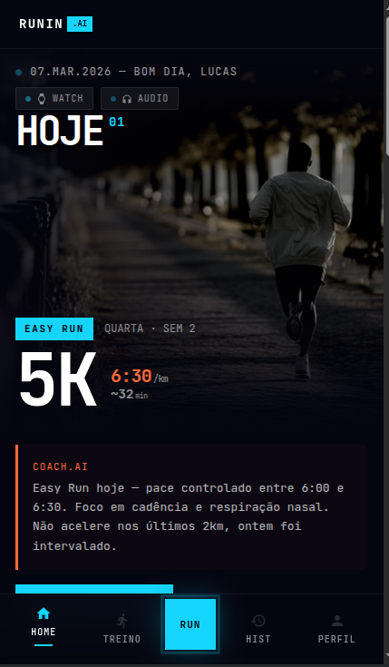

# Onboarding & Authentication Flow

User entry point and setup experience.

## Screen Overview

### 1. Splash Screen
**File**: `SPLASH.pdf`  
**Visual Reference**: 

**Purpose**: App launch screen shown while coach initializes.

**Layout**:
```
┌─────────────────────────────┐
│                             │
│                             │
│                             │
│        RUNNIN .AI           │  ← Logo (white + cyan accent)
│                             │
│  FEITO PARA VENCEDORES      │  ← Tagline (secondary text)
│                             │
│  ─────────────────          │  ← Loading bar (cyan)
│                             │
│                             │
│                             │
└─────────────────────────────┘
```

**Design Notes**:
- Pure black background
- Centered layout
- Loading indicator provides visual feedback
- Duration: 2-3 seconds while backend initializes

---

### 2. Login - Phone Entry
**File**: `LOGIN.pdf` (Page 1)

**Purpose**: Phone number collection for authentication.

**Layout**:
```
┌─────────────────────────────┐
│ ← VOLTAR      RUNNIN .AI    │  ← Header (back button + logo)
├─────────────────────────────┤
│                             │
│ // LOGIN                    │  ← Section label (cyan, monospace)
│                             │
│ Entre na corrida            │  ← Heading (white, 32px)
│                             │
│ TELEFONE                    │  ← Label
│ ┌───────────────────────┐   │
│ │ +55 (11) 99999-9999   │   │  ← Input field (with mask)
│ └───────────────────────┘   │
│                             │
│ CÓDIGO OTP                  │  ← Label
│ ┌───────────────────────┐   │
│ │ _ _ _ _ _ _           │   │  ← Placeholder (6 digits)
│ └───────────────────────┘   │
│                             │
│ ┌───────────────────────┐   │
│ │  🔵 Google Sign-In    │   │  ← OAuth option
│ └───────────────────────┘   │
│                             │
├─────────────────────────────┤
│ PRÓXIMO ↗                   │  ← Primary button (cyan)
└─────────────────────────────┘
```

**Components**:
- **Back Button**: Outline style, gray
- **Phone Input**: Accepts +55 format, auto-formats
- **OTP Input**: 6-digit code entry (shows dashes as separators)
- **Google Button**: Full-width secondary button with OAuth logo
- **Next Button**: Cyan, full-width CTA

**Interaction Flow**:
1. User enters phone number
2. Taps "PRÓXIMO"
3. Backend sends OTP via SMS
4. Screen updates to show OTP field (or transitions to new screen)
5. User enters 6-digit code
6. Validation → home page

---

### 3. Onboarding Flow
**File**: `ONBOARDING.pdf`

**Purpose**: User setup configuration (multi-step process).

**Typical Steps**:
1. **Welcome Screen** - Coach introduction
2. **Personal Data** - Name, age, weight, height
3. **Running Experience** - Beginner/Intermediate/Advanced self-assessment
4. **Goals** - Weekly km target, personal records to pursue
5. **Preferences** - Music (on/off), notifications, running pace zones
6. **Verification** - Confirm ready to start

**Screen Template for Each Step**:
```
┌─────────────────────────────┐
│ ← VOLTAR      RUNNIN .AI    │  ← Header
├─────────────────────────────┤
│                             │
│ // ONBOARDING              │  ← Section label
│ [Step 2 of 6]              │  ← Progress indicator
│                             │
│ Your Running Level          │  ← Question heading
│                             │
│ ○ Beginner                  │  ← Radio button option 1
│ ○ Intermediate              │  ← Radio button option 2
│ ○ Advanced                  │  ← Radio button option 3
│                             │
├─────────────────────────────┤
│ ← VOLTAR    PRÓXIMO ↗      │  ← Navigation buttons
└─────────────────────────────┘
```

**Pattern**:
- Clear step indicator (e.g., "Step 2 of 6")
- Single question per screen
- Multiple choice or toggle options
- Back/Next navigation
- Progress bar at top (optional)

---

## Design Specifications

### Typography
- **Section Label**: 12px, monospace, cyan, `// ONBOARDING`
- **Heading**: 32px, white, bold, `Enter na corrida`
- **Label**: 14px, gray, `TELEFONE`
- **Body**: 16px, white, regular

### Spacing
- Screen edge padding: 16px
- Field spacing: 24px
- Button height: 48px
- Focus state: cyan border (1.5px)

### Input Fields
- Height: 48px
- Padding: 12px (horizontal), 8px (vertical)
- Border: 1px solid `#333333`
- Placeholder color: `#666666`
- Focus: Border changes to cyan, background brightens to `#0F0F0F`

### Buttons
- **Primary** (Next): Cyan background, black text, 48px height
- **Secondary** (Back): Outlined, white text, 44px height
- **Social** (Google): Outlined, icon + text, 48px height

---

## States to Document

- [ ] Phone input with valid number
- [ ] Phone input with invalid format
- [ ] OTP input (partially filled)
- [ ] OTP input (all filled)
- [ ] Loading state (sending SMS)
- [ ] Error state (invalid OTP)
- [ ] Onboarding step complete state
- [ ] Final screen (all steps done)

---

## Implementation Checklist

- [ ] Phone number field has input mask (+55 format)
- [ ] OTP field accepts 6 digits only
- [ ] Google OAuth integration
- [ ] Back navigation restores form state
- [ ] Progress indicator updates correctly
- [ ] Form validation messages are clear
- [ ] Focus states use cyan border
- [ ] Keyboard type matches input (phone, numeric)
- [ ] Safe area bottom padding (56px for potential nav)

---

**Reference**: `LOGIN.pdf`, `ONBOARDING.pdf`
**Last Updated**: 2026-05-14
