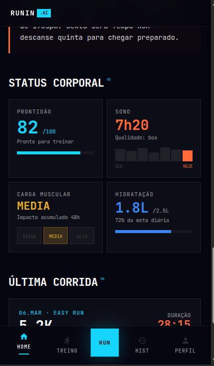
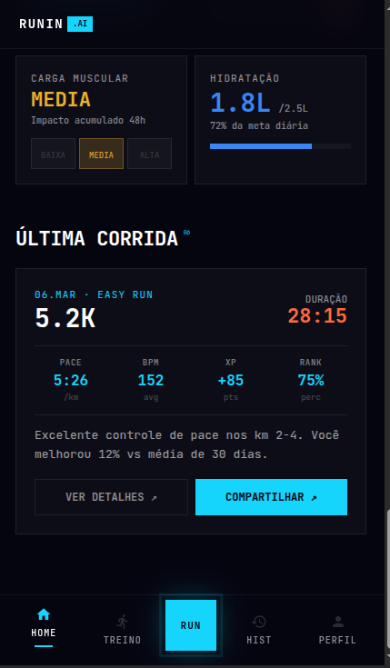
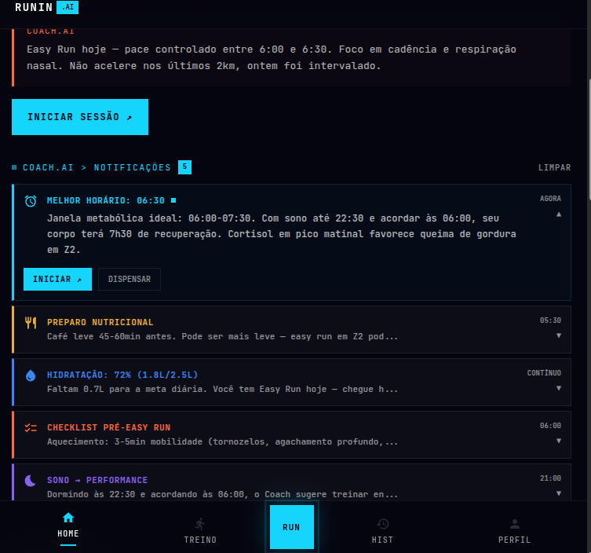
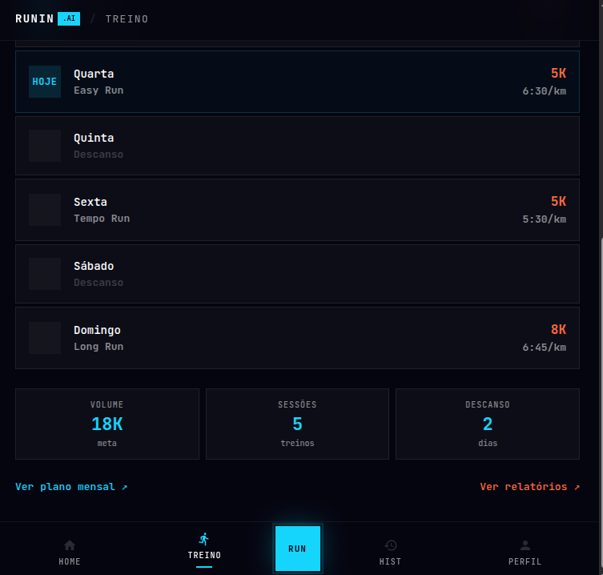
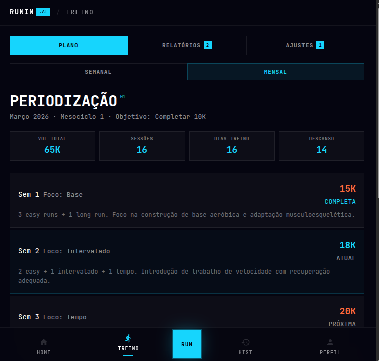
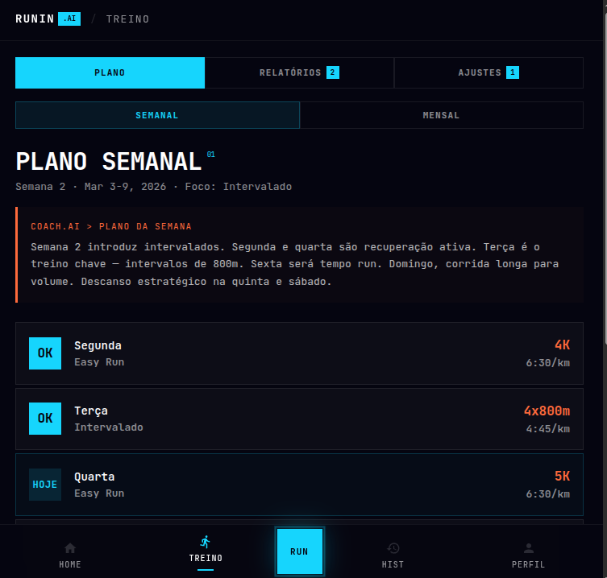
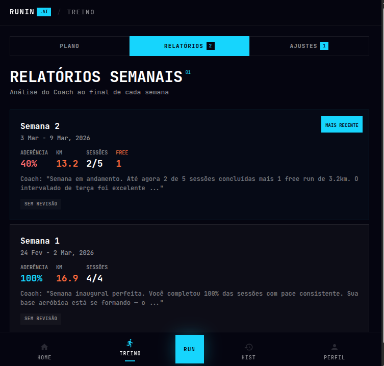
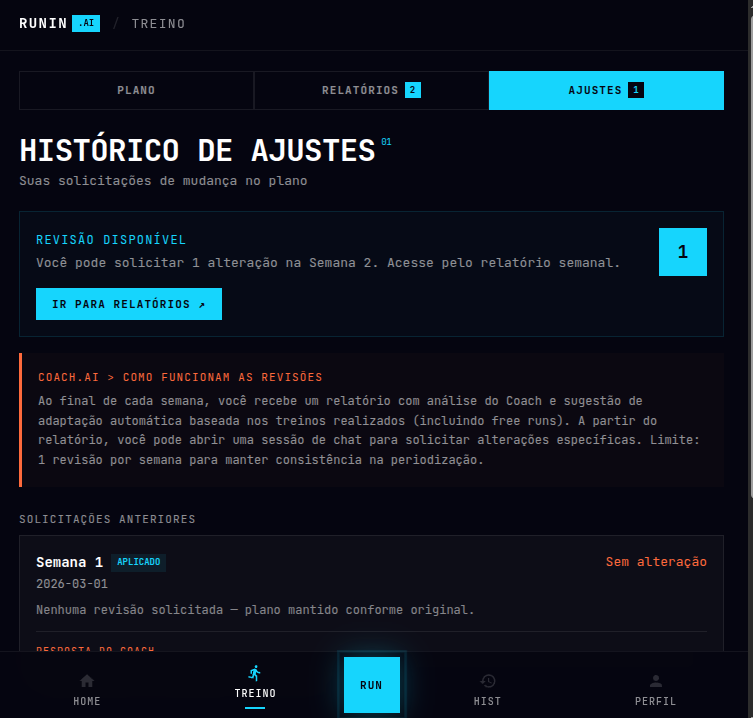
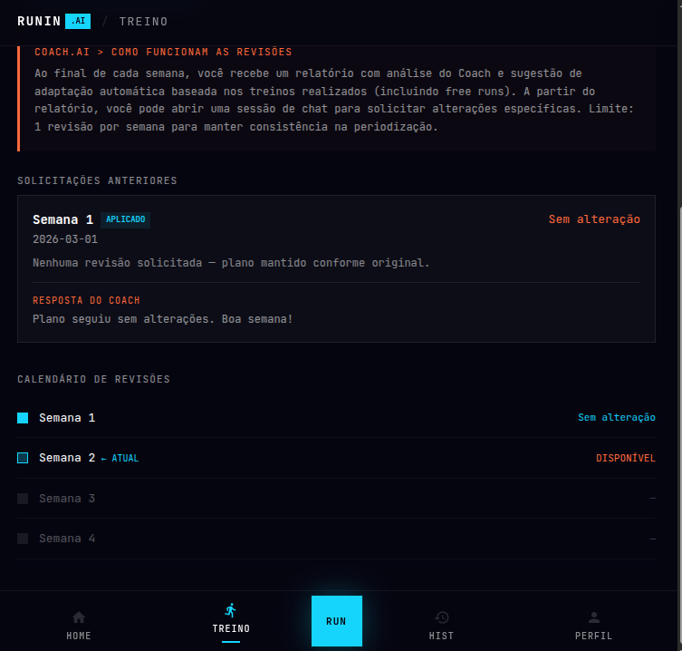
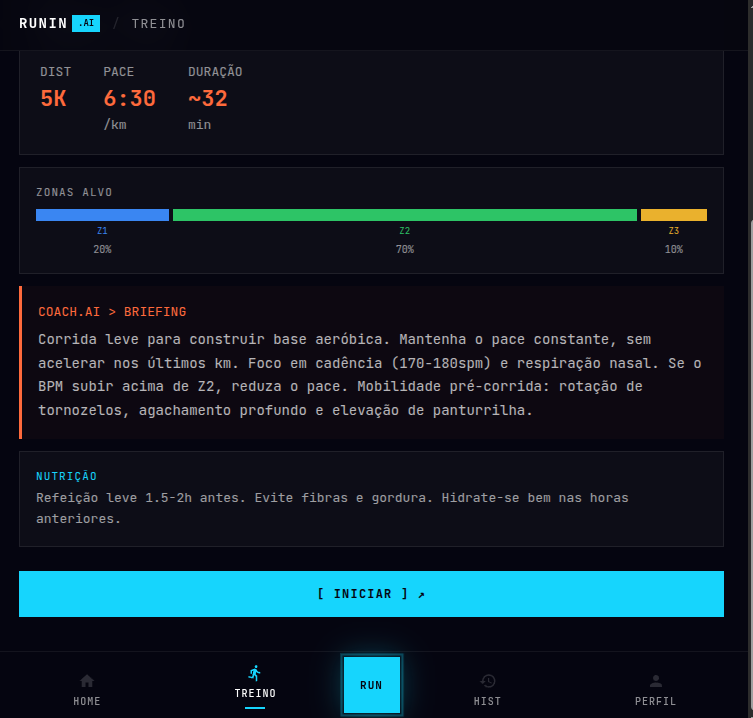

# Main App: Home & Assessment

Core dashboard and runner level assessment.

## Overview

These screens form the main application hub after successful authentication.

---

## Home Screen

**File**: `HOME.pdf`  
**Visual Reference**: 

**Purpose**: Main dashboard showing recent activity, upcoming training, and quick access to key features.

### Typical Layout

```
┌─────────────────────────────┐
│ 👤      Home      ⚙️         │  ← Header (avatar, title, settings)
├─────────────────────────────┤
│                             │
│ Hello, Runner! 📍           │  ← Greeting + date
│ Tuesday, May 14, 2026       │
│                             │
│ ┌─────────────────────────┐ │
│ │ This Week               │ │  ← Stats card
│ │ 32.4 km • 3h 24m        │ │
│ │ 5 runs • 6.5 km avg     │ │
│ └─────────────────────────┘ │
│                             │
│ UPCOMING TRAINING           │  ← Section label
│ ┌─────────────────────────┐ │
│ │ Tomorrow at 7:00 AM     │ │  ← Training card
│ │ Easy 10K - Endurance    │ │
│ │ Coach prepared ✓        │ │
│ │ [Start Running ↗]       │ │
│ └─────────────────────────┘ │
│                             │
│ RECENT RUNS                 │  ← Section label
│ ┌─────────────────────────┐ │
│ │ Today • 10.5 km         │ │  ← Run item 1
│ │ 56:32 • 5'24"/km        │ │
│ └─────────────────────────┘ │
│ ┌─────────────────────────┐ │
│ │ Yesterday • 5.2 km      │ │  ← Run item 2
│ │ 26:14 • 5'02"/km        │ │
│ └─────────────────────────┘ │
│                             │
├─────────────────────────────┤
│ 🏠 Home  📅 Treino  📊 Hist │  ← Bottom navigation
└─────────────────────────────┘
```

### Key Components

**Header**
- User avatar (or initials)
- "Home" title (centered)
- Settings icon (gear) for app settings

**Greeting Section**
- Personalized greeting ("Hello, Runner!")
- Current date and day of week
- Optional: weather icon / external conditions

**Stats Card**
- Weekly summary:
  - Total km run
  - Total time
  - Number of runs
  - Average distance per run
- Visual indicators (progress bars, badges)

**Upcoming Training Card**
- Next scheduled training session
- Planned start time
- Training type (easy, tempo, hard, recovery)
- Primary CTA: "Start Running ↗" (cyan button)
- Secondary info: "Coach prepared" check mark

**Recent Runs List**
- Reverse chronological order
- Per run shows:
  - Date (Today, Yesterday, or date)
  - Distance (km)
  - Duration (mm:ss)
  - Pace (m:ss/km)
  - Optional: quick map preview
- Tap to view detailed run report

**Bottom Navigation**
- 4-5 tabs:
  - 🏠 Home (active)
  - 📅 Treino (Training plans)
  - 📊 Histórico (History)
  - 👤 Perfil (Profile)
  - ⚙️ More (if needed)
- Active tab: cyan icon + underline
- Inactive: gray icon

### State Variations

**Empty State** (new user, no runs yet)
- "Ready to start running?" message
- "Get Started" CTA button
- Coach introduction card

**Loading State**
- Skeleton loaders for each section
- Shimmer animation
- "Coach is preparing..." message for upcoming training

**No Upcoming Training**
- "Rest day!" message
- Link to view full training plan
- "Create Custom Training" option

---

## Assessment Screen

**File**: `ASSESSMENT.pdf`  
**Visual References**: 
- 
- 
- 
- 
- 
- 
- 
- 
- 

**Purpose**: Running level assessment quiz to determine initial coach settings and training plan difficulty.

### Flow Structure

Multi-step questionnaire that gathers:
1. **Running Background** - Years of running experience
2. **Current Level** - Current weekly mileage
3. **Pace Assessment** - Self-rated 5K/10K pace capabilities
4. **Goals** - What runner wants to achieve
5. **Limitations** - Any injuries or physical constraints
6. **Preferences** - Music, voice feedback, intensity preferences

### Screen Template per Question

```
┌─────────────────────────────┐
│ ← VOLTAR      RUNNIN .AI    │  ← Header
├─────────────────────────────┤
│                             │
│ ASSESSMENT                  │  ← Section label (cyan)
│ [Question 2 of 6]          │  ← Progress
│                             │
│ How many years have you     │  ← Question (heading size)
│ been running?               │
│                             │
│ ○ Less than 1 year          │  ← Radio buttons
│ ○ 1-3 years                 │
│ ○ 3-5 years                 │
│ ○ 5+ years                  │
│                             │
├─────────────────────────────┤
│ ← VOLTAR    PRÓXIMO ↗      │  ← Navigation
└─────────────────────────────┘
```

### Question Types

**Type A: Multiple Choice**
- Radio buttons
- Single selection required
- Clear descriptive text

**Type B: Scale/Rating**
- Slider (1-10) or rating buttons
- Visual feedback on selection

**Type C: Multi-select**
- Checkboxes
- Applicable to injuries/constraints

**Type D: Text Input**
- Open-ended responses
- For pace (e.g., "5:30 /km") or goals

### Result/Summary Screen

```
┌─────────────────────────────┐
│                             │
│ // RESULTADO                │  ← Result heading
│                             │
│ Seu Nível: INTERMEDIÁRIO    │  ← Level classification
│                             │
│ Based on your responses:    │  ← Summary
│ • 3 years of experience     │
│ • Current pace: 5:45 /km    │
│ • Goal: improve speed       │
│                             │
│ Your coach will prepare     │  ← Next steps
│ a personalized plan.        │
│                             │
│ Features unlocked:          │  ← Coach features
│ ✓ Interval training plans   │
│ ✓ Real-time pace coaching   │
│ ✓ Performance analysis      │
│                             │
├─────────────────────────────┤
│ [Começar ↗]                │  ← CTA
└─────────────────────────────┘
```

---

## Design Notes

### Typography
- **Section Label**: 12px, cyan, monospace (`// ASSESSMENT`)
- **Progress**: 12px, gray, `[Question 2 of 6]`
- **Question**: 24px, white, bold
- **Option Label**: 16px, white
- **Result Heading**: 28px, cyan, bold

### Form Layout
- Max width: 100% (full screen)
- Padding: 16px sides, 24px top/bottom
- Field spacing: 16px between options
- Focus indicator: cyan highlight/border

### Color Coding (Optional)
- Question text: white
- Selected option: cyan accent
- Unselected: gray
- Disabled: very dark gray, very low opacity

### Progress Indication
- Visible step counter: `[2 of 6]`
- Optional: progress bar at top (10% per step)
- Back button always available

---

## Implementation Checklist

- [ ] Assessment questions are loaded from backend or config
- [ ] Answer validation before proceeding
- [ ] Back button preserves answers (no loss of progress)
- [ ] Progress counter increments correctly
- [ ] Result screen shows classification + summary
- [ ] Next steps are clear (e.g., "Coach is preparing your plan")
- [ ] Accessibility: labels linked to inputs
- [ ] Radio buttons are large enough (48px+ touch target)
- [ ] Loading state while processing results

---

**Reference**: `HOME.pdf`, `ASSESSMENT.pdf`
**Last Updated**: 2026-05-14
