# Training Flow: Plans & Active Run Session

Pre-run planning and real-time coaching experience.

---

## Training Plan Screen

**File**: `TREINO.pdf`  
**Visual References**:
- 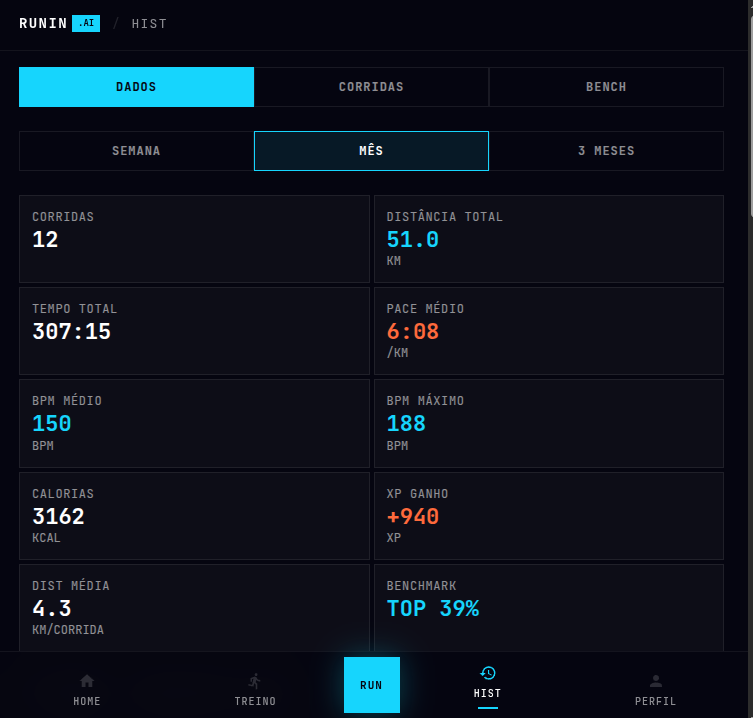
- 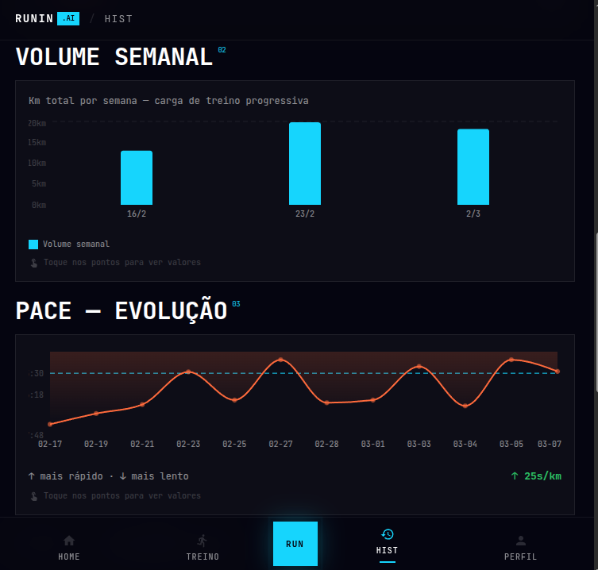
- 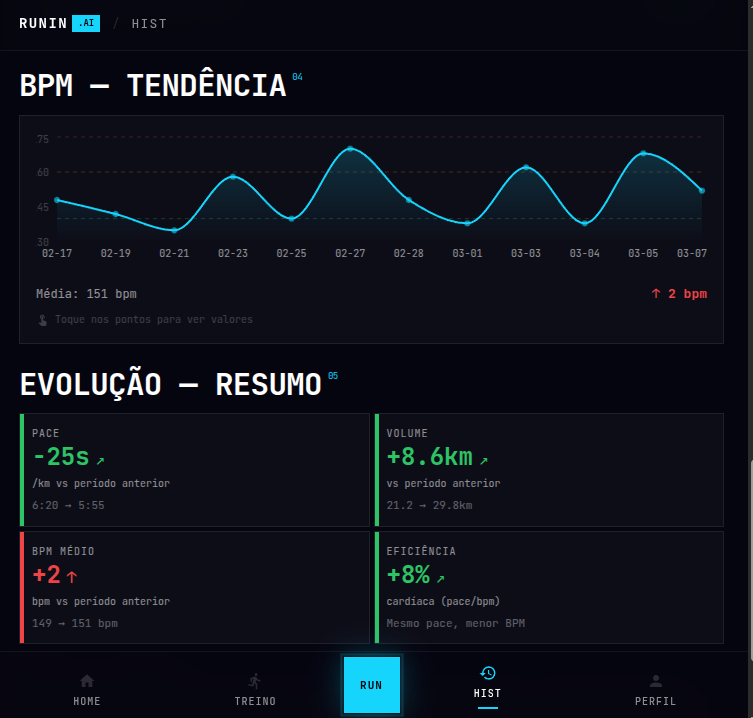
- 
- 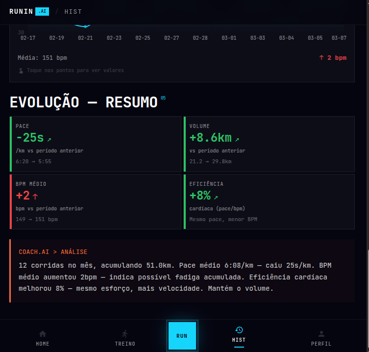
- 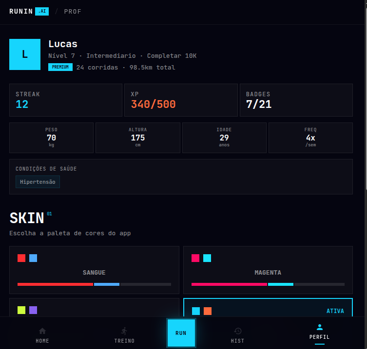
- 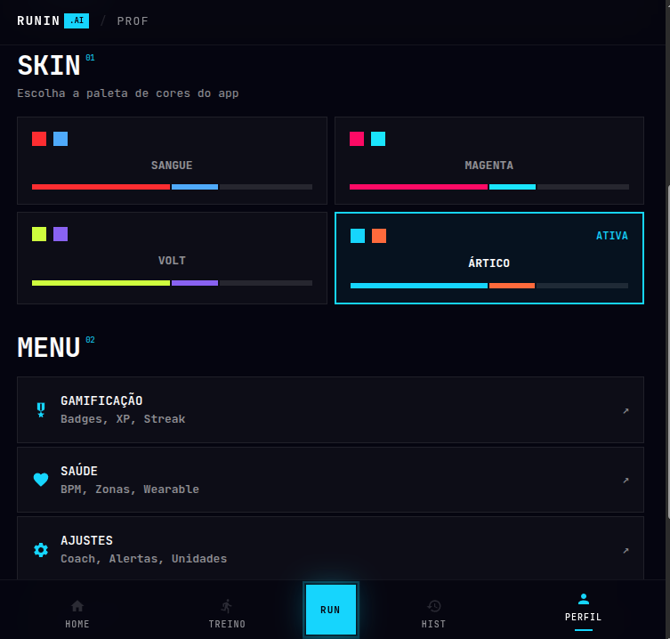
- 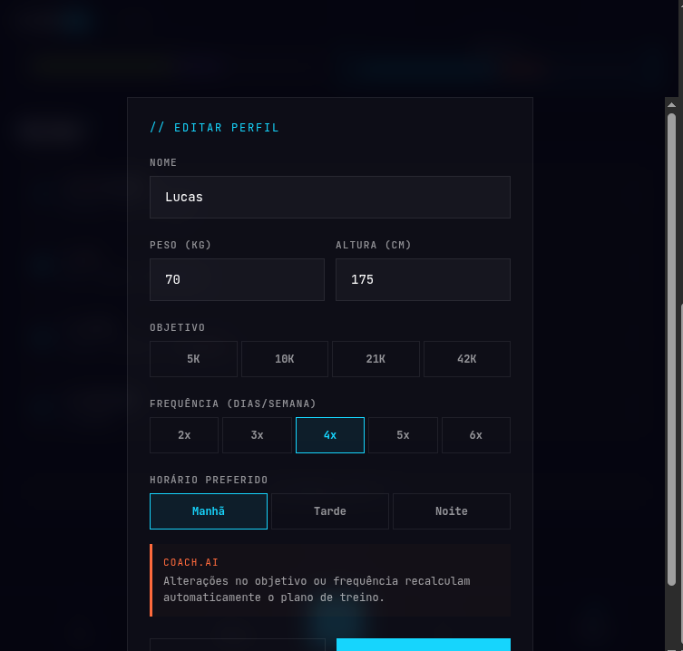
- 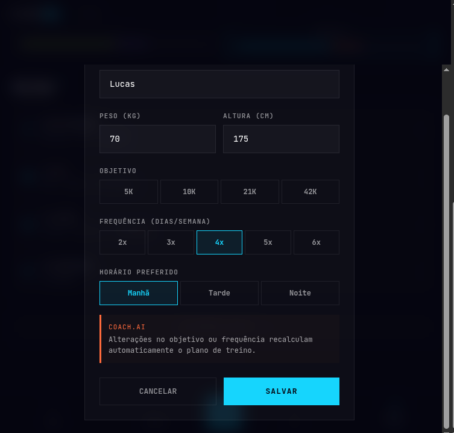
- 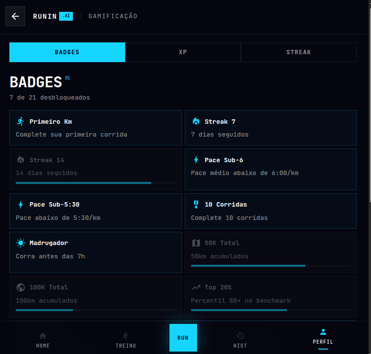

**Purpose**: View, understand, and customize training plans generated by Coach.

### Typical Layout

```
┌─────────────────────────────┐
│ ← VOLTAR      RUNNIN .AI    │  ← Header
├─────────────────────────────┤
│                             │
│ // PLANO DE TREINO         │  ← Section label
│                             │
│ Semana de 13-19 Maio       │  ← Week header
│                             │
│ MON 13  Descanso           │  ← Day without training
│         Rest               │
│                             │
│ TUE 14  Easy Run           │  ← Training day
│ ┌─────────────────────────┐ │
│ │ Easy Endurance          │ │  ← Training type
│ │ 10 km • 56 min          │ │  ← Metrics
│ │ Easy pace (Z1-Z2)       │ │  ← Intensity
│ │                         │ │
│ │ Coach tips:             │ │  ← Coach notes
│ │ Focus on cadence, not   │ │
│ │ speed. Enjoy the run.   │ │
│ │ [Começar ↗]            │ │  ← Start button
│ └─────────────────────────┘ │
│                             │
│ WED 15  Tempo Run          │  ← Training day
│ ┌─────────────────────────┐ │
│ │ Speed Building          │ │
│ │ 12 km • 1h 2min         │ │
│ │ Tempo pace (Z3-Z4)      │ │
│ │ [Começar ↗]            │ │
│ └─────────────────────────┘ │
│                             │
│ THU 16  Descanso           │
│ [Edit Plan ✎]             │  ← Edit action
│                             │
├─────────────────────────────┤
│ [Gerar Novo Treino ↗]     │  ← Regenerate button
└─────────────────────────────┘
```

### Key Components

**Week Header**
- Date range (e.g., "Semana de 13-19 Maio")
- Optional: weekly summary (total km, focus)

**Day Card - Rest Day**
- Day of week + date
- "Descanso" (Rest)
- Light gray color or lower opacity

**Day Card - Training Day**
- Day of week + date
- Training type name (e.g., "Easy Run", "Tempo Run", "Speed Intervals")
- Metrics:
  - Total distance (km)
  - Total time (min:sec)
  - Intensity zone (Z1-Z5 scale)
- Coach notes section:
  - Personalized tips
  - Focus areas
  - Form cues
  - Motivation message
- Primary CTA: "Começar ↗" (cyan button) to start run

**Control Buttons**
- "Edit Plan ✎" - modify this week's workouts
- "Gerar Novo Treino ↗" - ask coach to regenerate plan (bottom)

### Interaction Patterns

**Start Training**
- Tap "Começar ↗" on a training card
- Transition to Run Session screen
- Pre-populate metrics and coaching notes

**Edit Training**
- Tap "Edit Plan ✎"
- Allow adjusting:
  - Distance
  - Pace target
  - Intensity level
  - Time slot
- Save changes → coach adapts future sessions

**Regenerate Plan**
- Coach analyzes past performance
- Generates new week based on progress
- Shows summary of changes

---

## Run Session Screen

**File**: `RUN.pdf`  
**Visual References**:
- 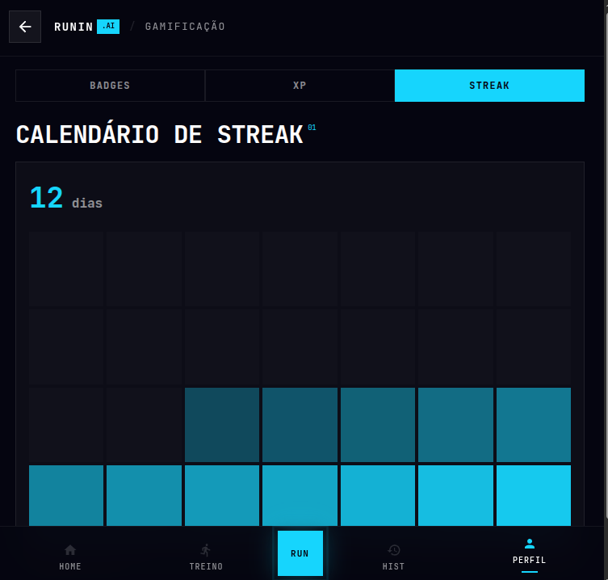
- 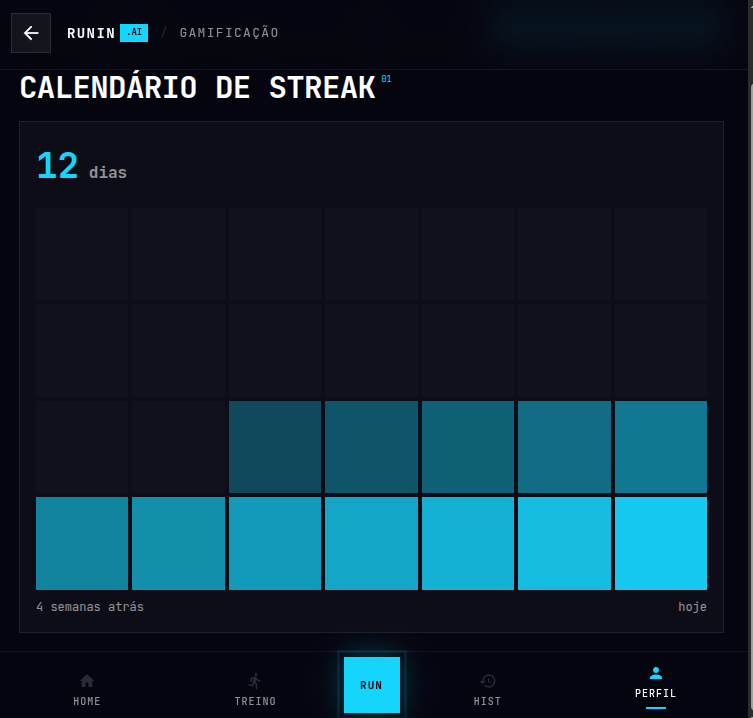
- 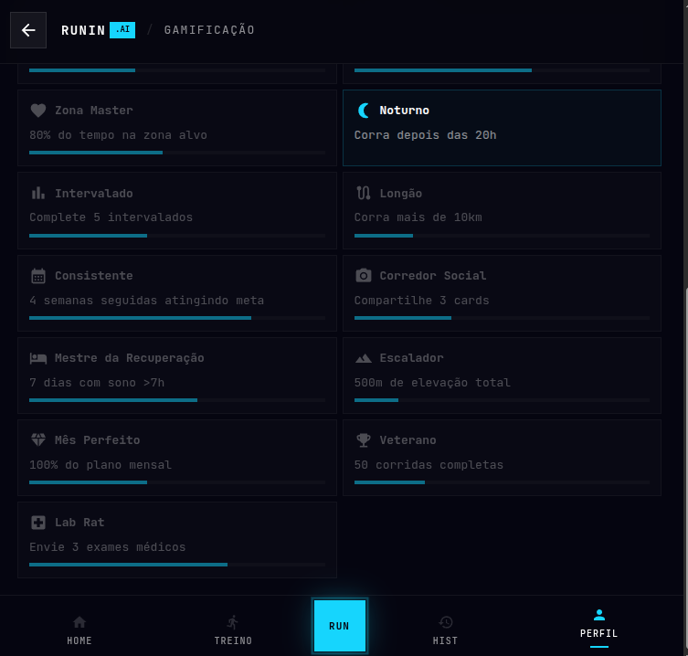
- 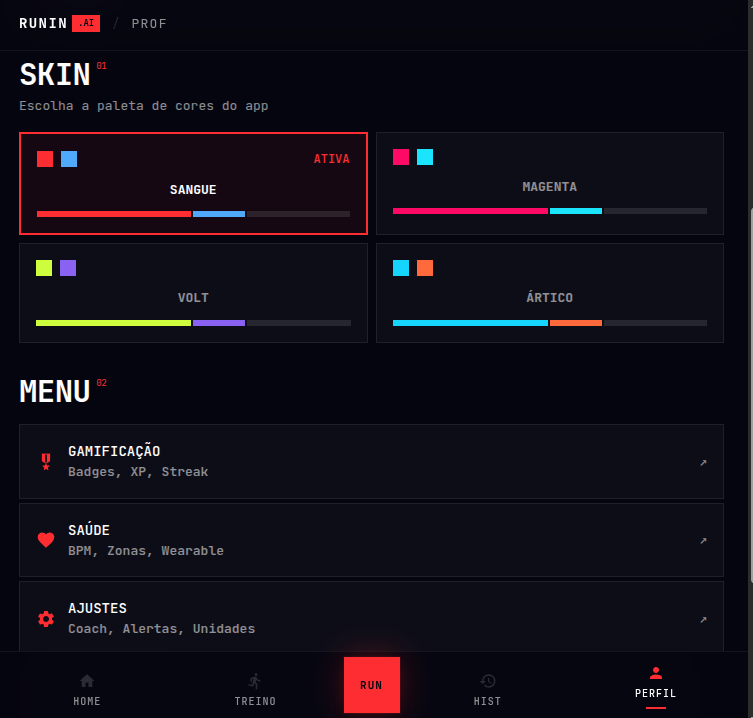
- 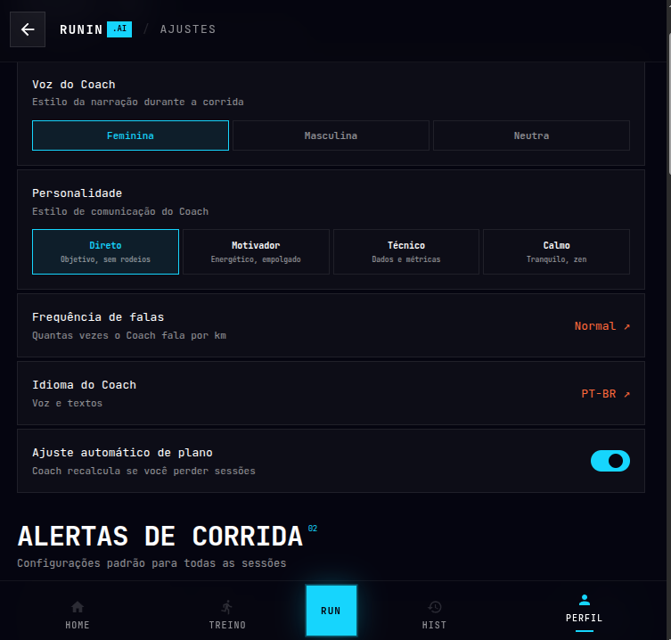
- 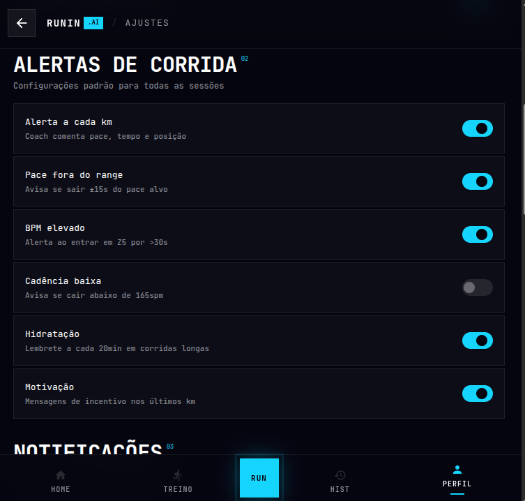
- 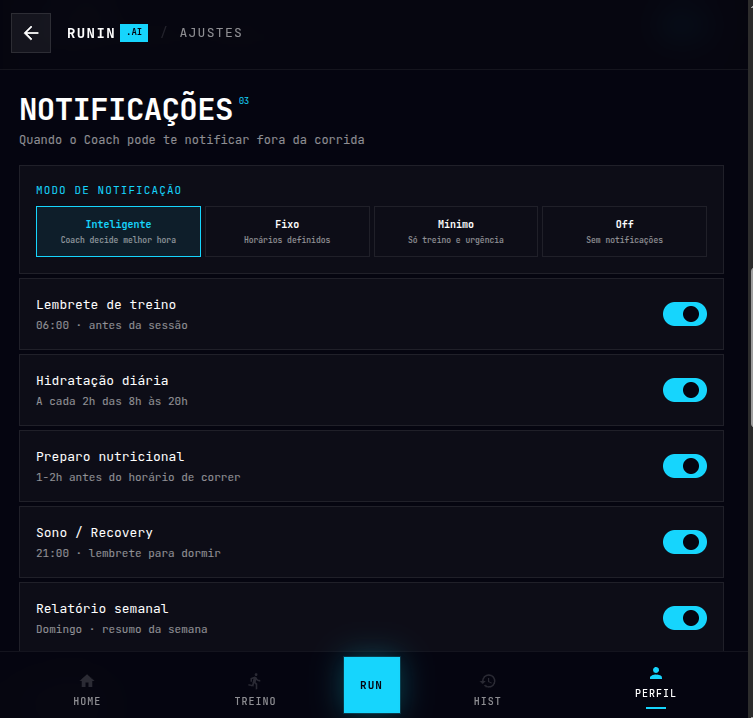
- 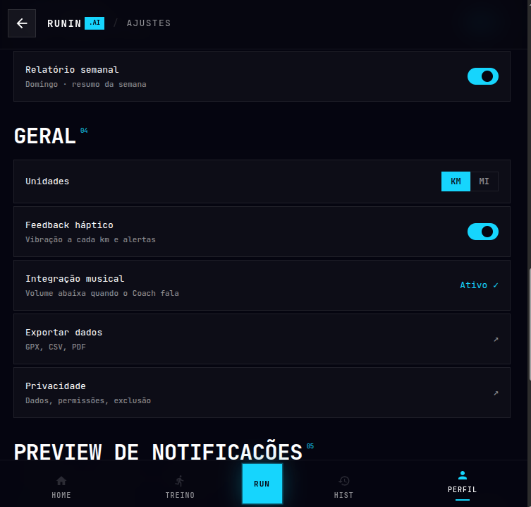
- 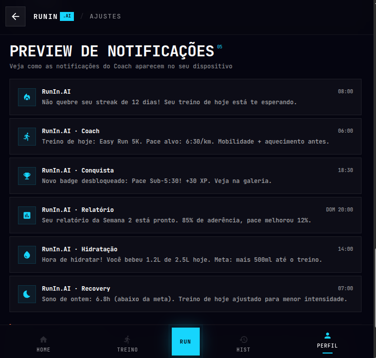

**Purpose**: Real-time run tracking with live coach guidance and metrics.

### Typical Layout (Multi-State)

#### 1. Map View (Primary)

```
┌─────────────────────────────┐
│  ← PAUSE        GPS  •••    │  ← Header (minimal controls)
├─────────────────────────────┤
│                             │
│                             │
│   [MAP VIEW with GPS track]  │  ← Scrollable map (tap to expand)
│                             │
│                             │
├─────────────────────────────┤
│ REAL-TIME METRICS           │  ← Metrics panel (draggable)
│                             │
│ Distance      10.5 km       │  ← Live distance
│ Pace          5'24" /km     │  ← Current pace
│ Time          56:45         │  ← Elapsed time
│ HR            168 bpm       │  ← Heart rate (if connected)
│ Zone          Z3 (Tempo)    │  ← Intensity zone
│                             │
│ ┌─────────────────────────┐ │
│ │ Coach: Pace down        │ │  ← Coach message (auto-pop)
│ │ slightly to Z2.         │ │
│ │ You're doing great!     │ │
│ │ [Dismiss]               │ │
│ └─────────────────────────┘ │
│                             │
├─────────────────────────────┤
│ [PAUSE]  [SOS]  [STOP]     │  ← Bottom controls
└─────────────────────────────┘
```

#### 2. Metrics View (Expanded)

```
┌─────────────────────────────┐
│ ← MAP   MÉTRICAS   ⚙️       │  ← Tab navigation
├─────────────────────────────┤
│                             │
│ KM           TEMPO          │
│ 10.5         56:45          │  ← Large, bold
│                             │
│ PACE                        │
│ 5'24" /km                   │  ← Highlighted current zone
│                             │
│ Heart Rate (avg)            │  ← Optional, if device connected
│ 162 bpm                     │
│                             │
│ Splits (past km)            │  ← Detailed breakdown
│ 1 km: 5'21" (Z3)           │
│ 2 km: 5'26" (Z3)           │
│ 3 km: 5'20" (Z3)           │
│ ...                         │
│                             │
├─────────────────────────────┤
│ [← MAP]       [PAUSE]       │  ← Navigation
└─────────────────────────────┘
```

#### 3. Coach Panel (Pop-up)

```
┌─────────────────────────────┐
│ COACH GUIDANCE              │  ← Header
├─────────────────────────────┤
│                             │
│ 🎤 "You're approaching      │  ← Voice message (text shown)
│    the 10km mark!           │
│    Maintain your pace.      │
│    Great effort!"           │
│                             │
│ [Audio Playing: 0:15 / 0:28]│  ← Audio indicator
│                             │
│ Upcoming:                   │  ← Preview of next cue
│ At 11km mark               │
│ Music will duck out        │
│                             │
├─────────────────────────────┤
│ ❓ Ask Coach:              │  ← User interaction
│ [How am I doing?]          │
│ [Need water soon?]         │
│ [Speech input 🎤]          │
│                             │
│ [Dismiss]                   │  ← Close
└─────────────────────────────┘
```

### Key Components

**Header Bar**
- Back/Pause button (left)
- GPS indicator / signal strength
- Menu icon (right) for session options

**Map View**
- Real-time GPS tracking
- Route history
- Start/current location markers
- Pace color-coded path (easier = cooler colors, harder = warmer)
- Tap to expand fullscreen
- Pinch to zoom

**Metrics Panel**
- Primary metrics:
  - Distance (km)
  - Pace (m:ss/km)
  - Time (elapsed)
  - Heart rate (if wearable connected)
  - Intensity zone (Z1-Z5)
- Updates every second
- Larger during run, collapsible
- Swipe to see split history

**Coach Panel**
- Auto-appears at milestones (every km, zone changes, pace alerts)
- Displays coach guidance:
  - Text version of audio message
  - Duration indicator
  - Preview of upcoming cues
- User can interact:
  - Ask questions (predefined or voice)
  - Dismiss message
  - Mute audio for this run

**Controls (Bottom)**
- **[PAUSE]**: Pauses timer and tracking
- **[SOS]**: Emergency contact (sends location)
- **[STOP]**: Ends run, shows summary

---

## Plan Loading Screen

**File**: `PLAN_LOADING.pdf`  
**Visual Reference**: 

**Purpose**: Feedback while coach generates training plan (1-3 seconds).

### Layout

```
┌─────────────────────────────┐
│                             │
│                             │
│   RUNNIN .AI                │  ← Logo
│                             │
│   Coach está preparando     │  ← Message
│   seu treino...             │
│                             │
│   ◐◑◒◓◔◕ ◖◗ (spinner)      │  ← Loading animation
│                             │
│   Personalizando plano      │  ← Subtext (cycling messages)
│   baseado em seu nível...   │
│                             │
│                             │
└─────────────────────────────┘
```

### States

**Generating Message**
- Rotates through:
  - "Coach está preparando seu treino..."
  - "Analisando seu desempenho..."
  - "Personalizando plano..."
  - "Quase pronto!"

**Visual**
- Cyan spinner animation
- Dark background
- Centered layout
- Non-dismissible (user must wait)

**Timeout**
- Max 5 seconds
- If timeout exceeded, show:
  - "Taking longer than usual..."
  - "Retry" button
  - "Use default plan" fallback button

---

## Design Specifications

### Run Session Colors

**Pace Zones** (visual distinction):
- **Z1 (Recovery)**: `#0084FF` (cool blue)
- **Z2 (Easy)**: `#00BFFF` (cyan - normal)
- **Z3 (Tempo)**: `#FFD700` (gold)
- **Z4 (Hard)**: `#FF6B35` (orange)
- **Z5 (Max)**: `#FF3333` (red)

### Typography
- **Section Label**: 12px, monospace, cyan
- **Large Metrics**: 48px, white, bold (km, time)
- **Metric Label**: 12px, gray
- **Metric Value**: 24px, white
- **Coach Message**: 16px, white (body text)

### Touch Targets
- Buttons: 48px minimum
- Metrics: tap to expand/collapse
- Map: pinch/pan enabled
- Coach message: tap to dismiss

---

## Implementation Checklist

- [ ] GPS tracking starts immediately on run session start
- [ ] Metrics update every 1 second
- [ ] Coach messages appear at configurable milestones
- [ ] Pause/resume works correctly (doesn't reset data)
- [ ] Stop shows summary screen
- [ ] SOS button initiates emergency contact flow
- [ ] Audio ducking works with music player
- [ ] Heart rate sync with wearable (if available)
- [ ] Offline mode captures data for sync later
- [ ] Map renders smoothly without lag
- [ ] Screen stays on during run (wake lock)
- [ ] Battery warning if low percentage

---

**Reference**: `TREINO.pdf`, `RUN.pdf`, `PLAN_LOADING.pdf`
**Last Updated**: 2026-05-14
