# Profile & Statistics

User profile, settings, and historical data analysis.

---

## Profile Screen

**File**: `PERFIL.pdf`  
**Visual References**:
- 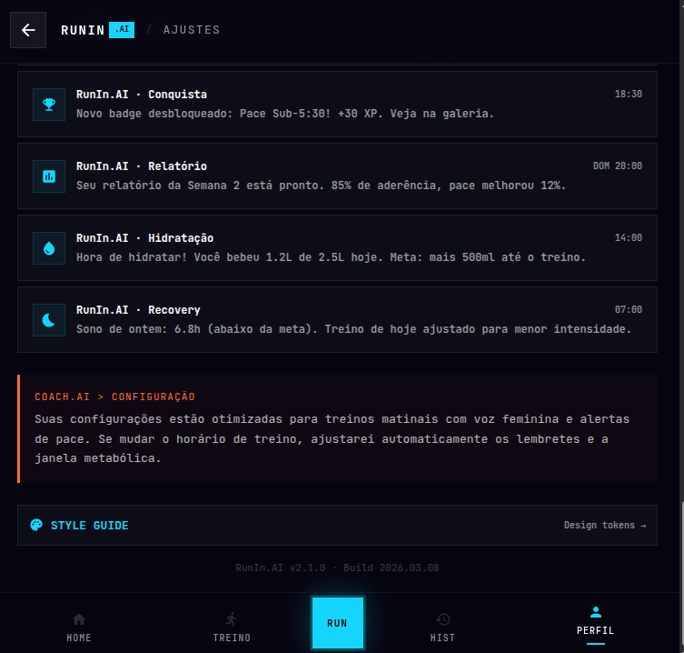
- 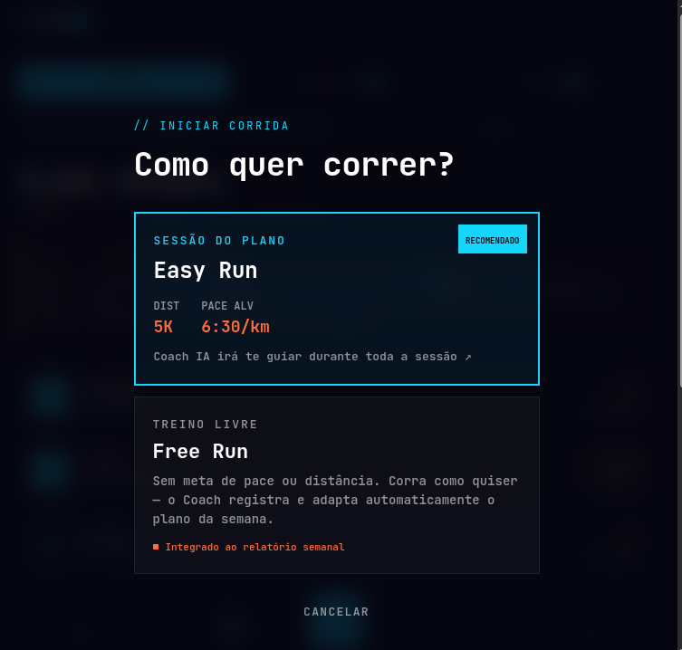
- 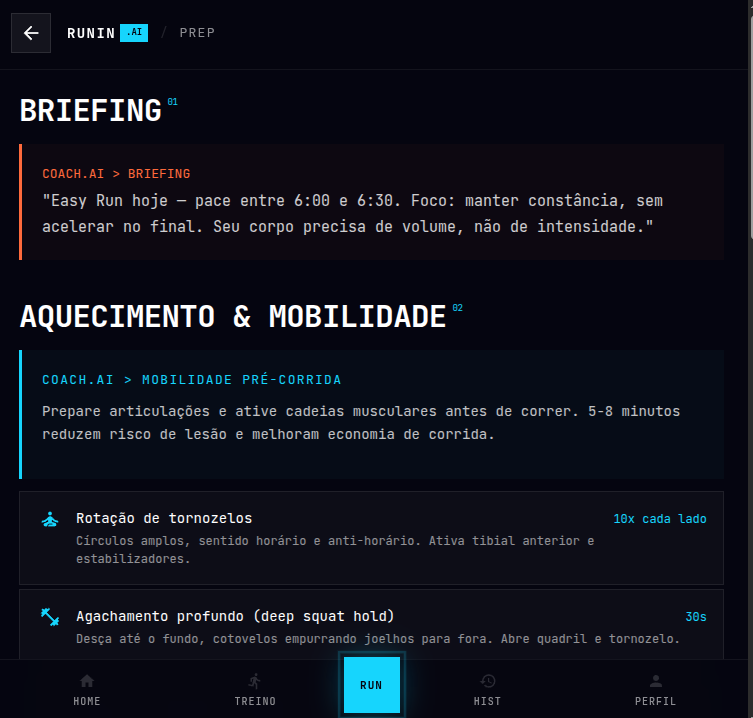
- 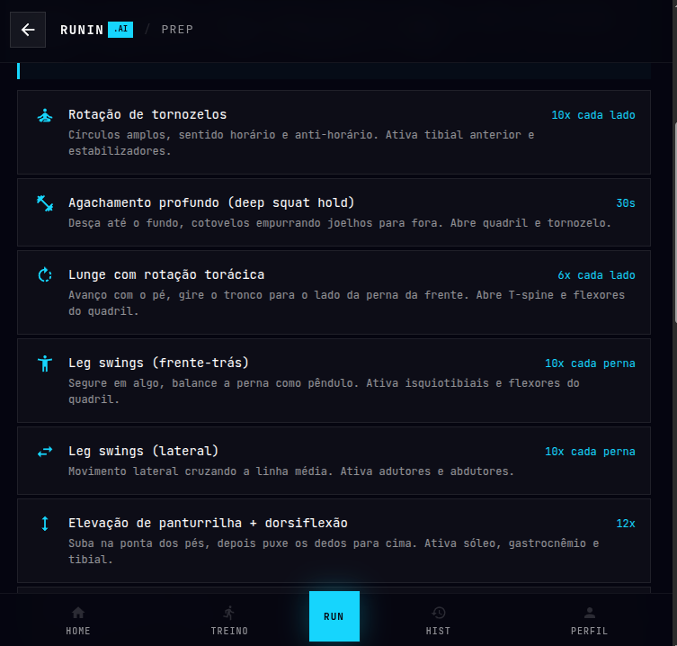
- 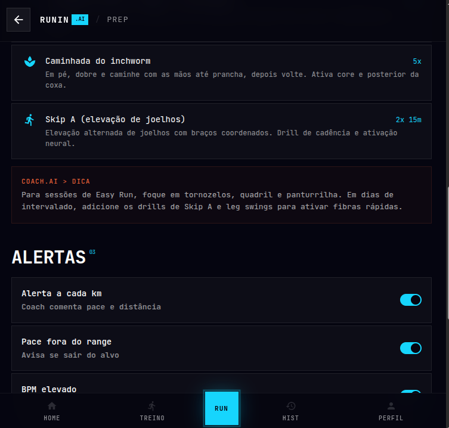
- 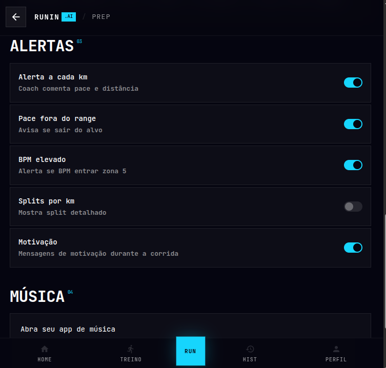
- 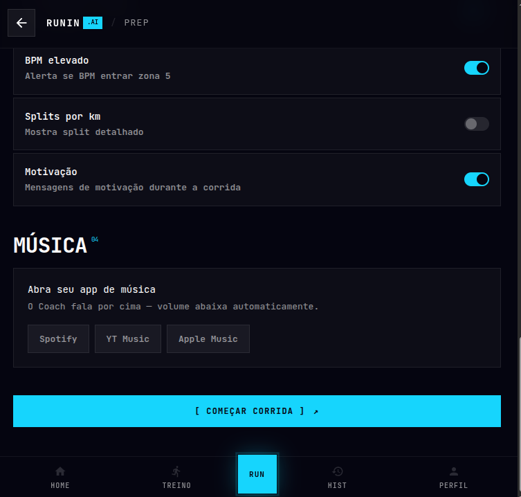
- 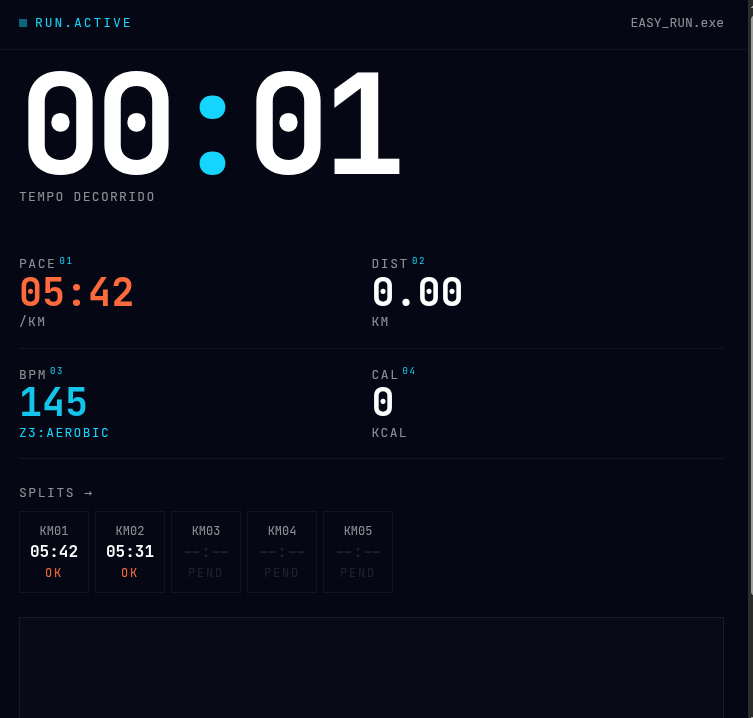

**Purpose**: User account hub with stats, preferences, and settings.

### Layout

```
┌─────────────────────────────┐
│                             │
│ ┌─────────────────────────┐ │
│ │  👤  João Silva         │ │  ← User card (avatar + name)
│ │  Level: Intermediate    │ │
│ │  🏃 Member since May '26│ │
│ └─────────────────────────┘ │
│                             │
│ ESTATÍSTICAS TOTAIS         │  ← Stats section (cyan label)
│                             │
│ Total Distance              │
│ 342.5 km                    │  ← Large, prominent
│                             │
│ Total Runs                  │
│ 47 runs                     │  ← Supporting metric
│                             │
│ Personal Records            │  ← Records sub-section
│ 5K: 18:32                   │
│ 10K: 39:45                  │
│ Half Marathon: (not set)    │
│                             │
│ ┌─────────────────────────┐ │
│ │ ACHIEVEMENTS            │ │  ← Badges/medals section
│ │ 🥇 100km  🎯 5-Run Streak│ │
│ │ 🔥 Hot Streak  ✨ Social │ │
│ └─────────────────────────┘ │
│                             │
│ PREFERÊNCIAS                │  ← Settings section
│                             │
│ ┌─────────────────────────┐ │
│ │ Music                   │ │  ← Toggle settings
│ │ [●─────] (ON)          │ │
│ └─────────────────────────┘ │
│ ┌─────────────────────────┐ │
│ │ Coach Voice             │ │
│ │ [●─────] Portuguese     │ │
│ └─────────────────────────┘ │
│ ┌─────────────────────────┐ │
│ │ Notifications           │ │
│ │ [●─────] (ON)          │ │
│ └─────────────────────────┘ │
│ ┌─────────────────────────┐ │
│ │ Heart Rate Zones        │ │  ← Editable settings
│ │ [Edit ✎]               │ │
│ └─────────────────────────┘ │
│                             │
│ ┌─────────────────────────┐ │
│ │ [Sair / Logout]         │ │  ← Logout button (muted)
│ └─────────────────────────┘ │
│                             │
├─────────────────────────────┤
│ 🏠 Home  📅 Treino  📊 Hist │  ← Bottom nav
└─────────────────────────────┘
```

### Key Components

**User Card (Top)**
- Avatar: initials or photo
- Full name
- Current level (Beginner/Intermediate/Advanced)
- Account metadata (member since date)
- Edit profile link

**Total Statistics Section**
- Prominent display of:
  - Total kilometers run
  - Total number of runs
  - Average pace / distance
- Visual representation (large numbers)

**Personal Records**
- Best 5K time
- Best 10K time
- Best half marathon (if any)
- Best marathon (if any)
- Allow editing / updating manually

**Achievements/Badges**
- Visual badges for unlocked milestones:
  - Distance milestones (100km, 500km, etc.)
  - Streak badges (5-day, 10-day running streak)
  - Speed badges (personal records)
  - Social badges (shared runs)
- Show count of unlocked achievements
- Tap to see full achievement list

**Preferences Section**
- **Music**: Toggle on/off for run sessions
- **Coach Voice**: Language/voice selection
- **Notifications**: Push notification toggle
- **Heart Rate Zones**: View/edit HR zones (Z1-Z5)
- Each preference has visual toggle or dropdown

**Account Actions**
- Edit profile (name, avatar)
- Change password
- Manage connected devices (wearables)
- Delete account option (with confirmation)
- Logout button

---

## Run History & Statistics

**File**: `HISTÓRICO.pdf`  
**Visual References**:
- 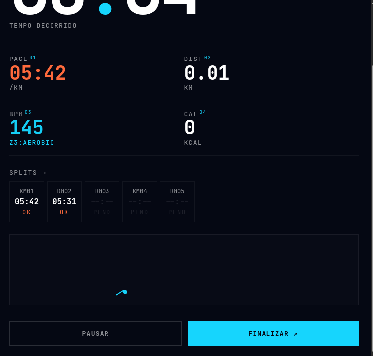
- 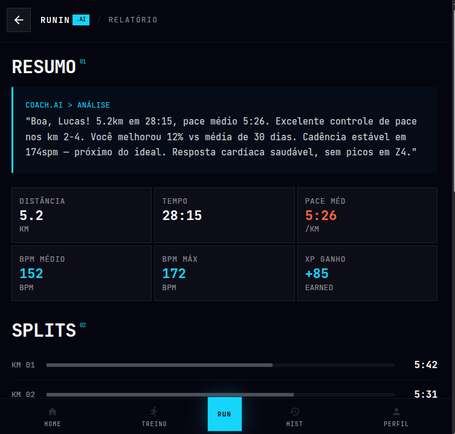
- 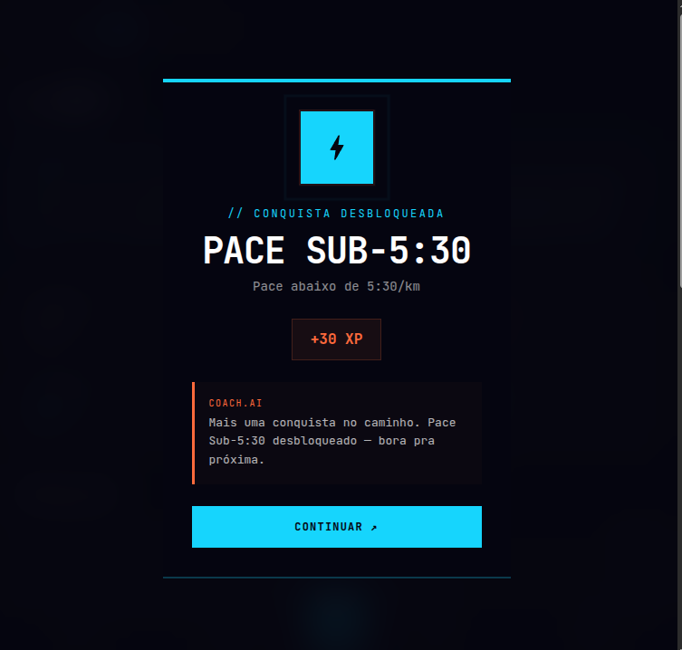
- 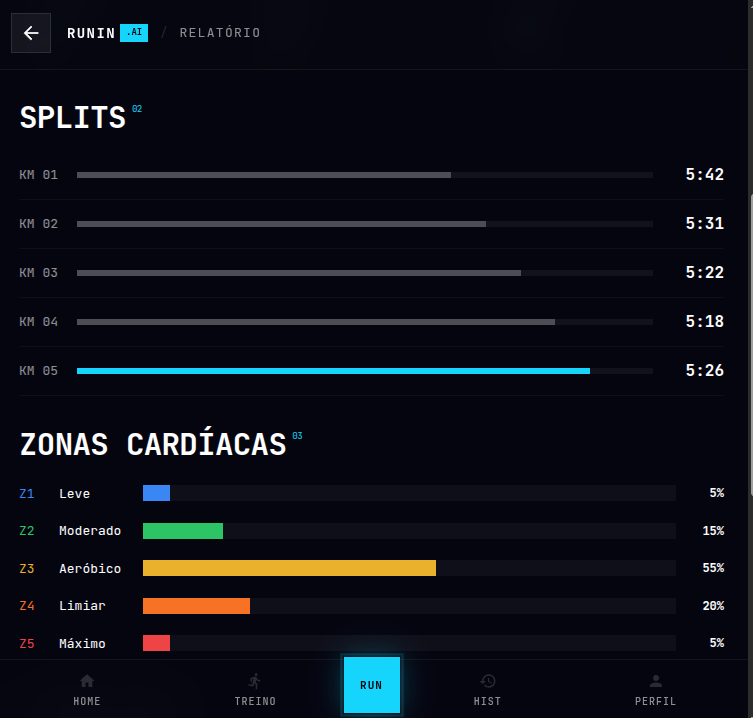
- 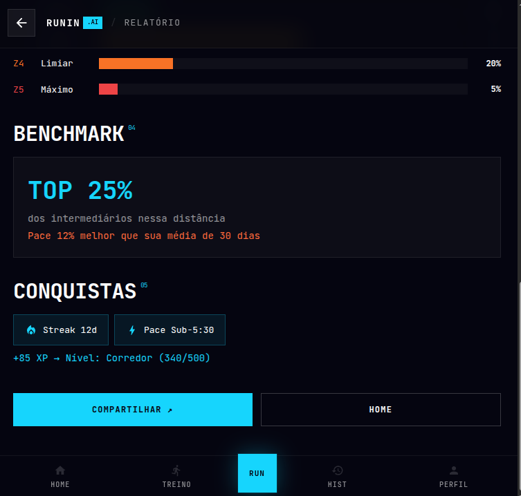

**Purpose**: Detailed analysis of past runs with timeline and performance trends.

### Layout - List View

```
┌─────────────────────────────┐
│ ← Home      RUNNIN .AI      │  ← Header
├─────────────────────────────┤
│                             │
│ // HISTÓRICO               │  ← Section label
│                             │
│ MAIO 2026                   │  ← Month header
│                             │
│ TUE, 14 MAI                 │  ← Day separator
│                             │
│ ┌─────────────────────────┐ │
│ │ Easy Run                │ │  ← Run card
│ │ 10.5 km  •  56m 32s     │ │
│ │ 5'24" /km               │ │
│ │ 🏃‍♂️ ★★★★☆               │ │  ← Rating / difficulty
│ │ [View Details ↗]        │ │
│ └─────────────────────────┘ │
│                             │
│ MON, 13 MAI                 │
│                             │
│ ┌─────────────────────────┐ │
│ │ Tempo Run               │ │
│ │ 12 km  •  1h 2m         │ │
│ │ 5'10" /km               │ │
│ │ 🏃‍♂️ ★★★★★               │ │
│ │ [View Details ↗]        │ │
│ └─────────────────────────┘ │
│                             │
│ APR 2026                    │  ← Previous month
│                             │
│ [Load more...]              │  ← Pagination
│                             │
├─────────────────────────────┤
│ 🏠 Home  📅 Treino  📊 Hist │  ← Bottom nav
└─────────────────────────────┘
```

### Layout - Calendar View

```
┌─────────────────────────────┐
│ ← [List] (Calendar) [Stats] │  ← View toggle
├─────────────────────────────┤
│ May 2026  [< >]             │  ← Month selector
├─────────────────────────────┤
│ Mo Tu We Th Fr Sa Su        │  ← Calendar header
│  1  2  3  4  5  6  7       │
│  8  9 10 11 12 13 14 ← 13km│  ← Day with run
│ 15 16 17 18 19 20 21 ← 12km│
│ 22 23 24 25 26 27 28       │
│ 29 30 31                    │
│                             │
│ Tap day to see run details  │  ← Instructions
│                             │
└─────────────────────────────┘
```

### Run Detail Screen

```
┌─────────────────────────────┐
│ ← BACK                      │  ← Header
├─────────────────────────────┤
│                             │
│ Tuesday, May 14, 2026       │  ← Date
│ Easy Run - 10.5 km          │  ← Title
│                             │
│ [MAP PREVIEW - tap expand]  │  ← Route map
│                             │
│ RESUMO                      │  ← Summary section
│                             │
│ Distance     10.5 km        │
│ Duration     56:32          │
│ Pace         5'24" /km      │
│ Elevation    +125 m         │
│ Heart Rate   162 bpm (avg)  │
│                             │
│ PERFORMANCE                 │  ← Performance section
│                             │
│ Splits:                     │
│ 1 km: 5'21"                │
│ 2 km: 5'26"                │
│ 3 km: 5'20"                │
│ ... (10 km: 5'24")         │
│                             │
│ Coach Summary:              │  ← Coach feedback
│ "Great easy run! Your pace  │
│  was steady. Keep building  │
│  your aerobic base."        │
│                             │
│ [Share ↗]  [Edit ✎]        │  ← Actions
│                             │
└─────────────────────────────┘
```

### Calendar View - Statistics

```
┌─────────────────────────────┐
│ ← [List] (Calendar) [Stats] │
├─────────────────────────────┤
│                             │
│ May 2026 Statistics         │  ← Selected month
│                             │
│ Total Distance: 157.2 km    │
│ Total Runs: 12              │
│ Avg Distance: 13.1 km       │
│ Avg Pace: 5'28" /km        │
│                             │
│ ZONES DISTRIBUTION          │  ← Zone breakdown
│                             │
│ Z1 (Recovery):  10%         │
│ Z2 (Easy):      60%         │  ← Bar chart
│ Z3 (Tempo):     20%         │
│ Z4 (Hard):      8%          │
│ Z5 (Max):       2%          │
│                             │
│ PROGRESS                    │  ← Trend section
│                             │
│ Avg Speed Improvement       │
│ +1.3% vs Last Month        │  ← Positive metric
│                             │
│ [Year View]  [Yearly Stats] │  ← More options
│                             │
└─────────────────────────────┘
```

---

## Design Specifications

### Typography
- **Section Label**: 12px, cyan, monospace (`// HISTÓRICO`)
- **Month/Date Header**: 14px, gray, all-caps
- **Run Card Title**: 18px, white, bold
- **Run Card Details**: 14px, white (distance, time)
- **Pace**: 16px, cyan (highlighted)
- **Label**: 12px, gray

### Cards
- Background: `#0A0A0A`
- Border: 1px solid `#222222`
- Padding: 16px
- Spacing between cards: 12px

### Rating/Difficulty Indicator
- Star rating (1-5 stars)
- Or emoji intensity scale (🏃, 🏃💨, 🏃💨💨)
- Color-coded by pace zone

### Buttons
- "View Details ↗": inline link style
- "Share ↗": cyan link
- "Edit ✎": gray link or icon

---

## Implementation Checklist

- [ ] Profile stats update in real-time after runs
- [ ] Achievement badges unlock automatically
- [ ] History list loads previous months on scroll
- [ ] Calendar view shows all runs in month
- [ ] Run detail screen includes map visualization
- [ ] Performance trends calculated correctly
- [ ] Share functionality (WhatsApp, social media)
- [ ] Export run data (GPX, CSV) option
- [ ] Offline support (shows cached data)
- [ ] Privacy settings: choose which runs to make public
- [ ] Wearable sync status indicator

---

**Reference**: `PERFIL.pdf`, `HISTÓRICO.pdf`
**Last Updated**: 2026-05-14
